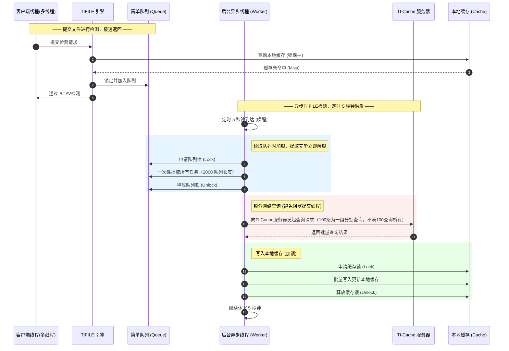

```mermaid
sequenceDiagram
    autonumber
    participant Client as 客户端线程(多线程)
    participant TIFILE as TIFILE 引擎
    participant Queue as 简单队列 (Queue)
    participant Async as 后台异步线程 (Worker)
    participant TICache as TI-Cache 服务器
    participant Cache as 本地缓存 (Cache)

    Note over Client, Queue: —— 提交文件进行检测，极速返回 ——
    Client->>TIFILE: 提交检测请求
    TIFILE->>Cache: 查询本地缓存 (锁保护)
    Cache-->>TIFILE: 缓存未命中 (Miss)
    TIFILE->>Queue: 锁定并加入队列 
    TIFILE->>Client: 通过 Bit AV检测
    
    Note over Async, TICache: —— 异步TI FILE检测，定时 5 秒钟触发 ——
    Async->>Async: 定时 5 秒钟到达 (唤醒)
    rect rgb(230, 245, 255)
        Note right of Async: 读取队列时加锁，提取完毕立即解锁
        Async->>Queue: 申请队列锁 (Lock)
        Async->>Queue: 一次性提取所有任务（2000 队列长度）
        Async->>Queue: 释放队列锁 (Unlock)
    end
    
    rect rgb(255, 240, 240)
        Note right of Async: 锁外网络查询 (避免阻塞提交线程)
        Async->>TICache: 向TI Cache服务器发起查询请求（100条为一组分批查询，不满100查询所有）
        TICache-->>Async: 返回批量查询结果
    end

    rect rgb(230, 255, 230)
        Note right of Async: 写入本地缓存 (加锁)
        Async->>Cache: 申请缓存锁 (Lock)
        Async->>Cache: 批量写入更新本地缓存
        Async->>Cache: 释放缓存锁 (Unlock)
    end
    
    Async->>Async: 继续休眠 5 秒钟
```
